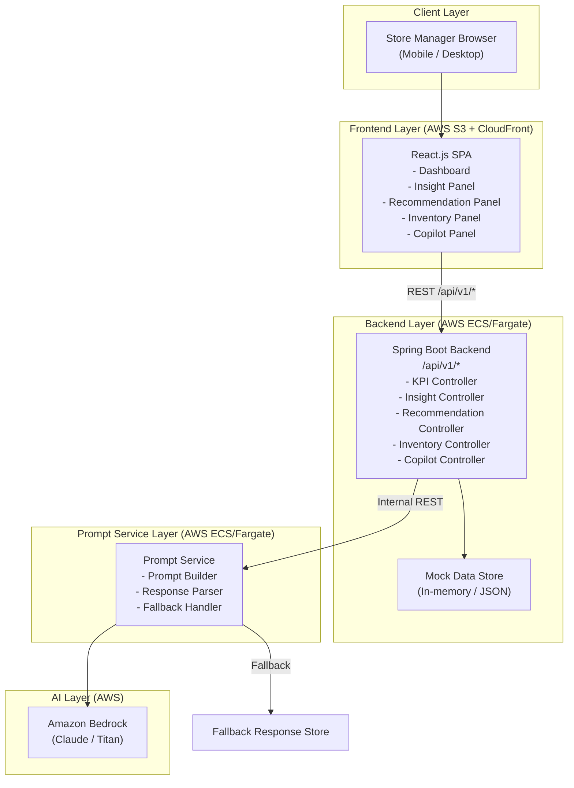
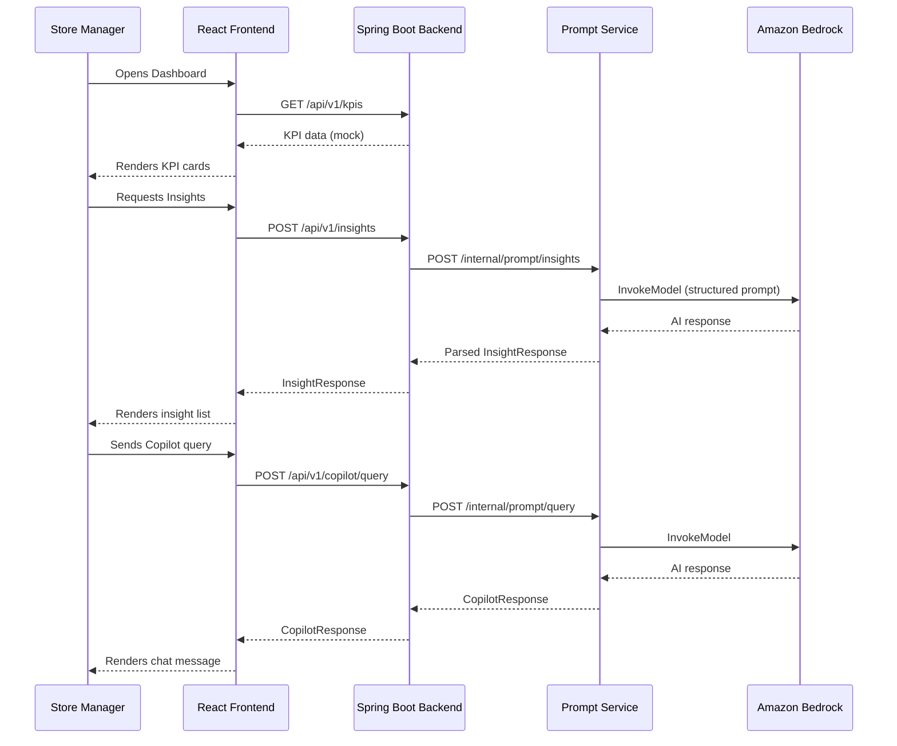
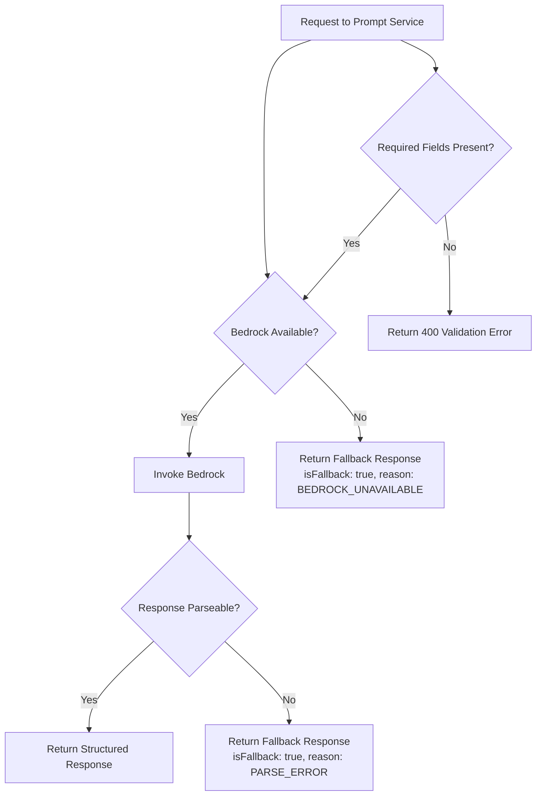

# Design Document: Retail Store Manager Copilot

## Overview

The Retail Store Manager Copilot is a mobile-first, AI-powered web application that gives retail store managers a single-screen command center for daily operations. The system surfaces real-time KPIs, AI-generated diagnostic insights, prioritized corrective action recommendations, inventory alerts, and a conversational AI panel — all within one responsive interface.

The design follows a three-tier modular architecture:

- **Frontend**: React.js SPA (single-page application), mobile-first, served via AWS CloudFront / S3
- **Backend**: Spring Boot REST API, business logic and data aggregation, deployed on AWS ECS/Fargate
- **Prompt Service**: Dedicated Spring Boot microservice for prompt construction and Amazon Bedrock integration, independently deployable

Key design goals:
- Sub-3-second initial render on mobile
- Graceful degradation when AI services are unavailable
- Clean separation between UI, business logic, and AI integration
- All AI interactions routed exclusively through the Prompt Service

---

## Architecture

### System Architecture Diagram



### Request Flow



---

## UI/UX Design

### Design Philosophy

The UI is designed around three principles:
1. **Glanceability** — a manager should understand store health within 2 seconds of opening the app
2. **Progressive disclosure** — KPIs are always visible; deeper AI analysis is one tap away
3. **Mobile-first** — designed for 375px width, scales gracefully to tablet and desktop

### Color Palette & Visual Language

| Token | Value | Usage |
|---|---|---|
| `--color-primary` | `#1A56DB` (blue) | CTAs, active states, links |
| `--color-success` | `#057A55` (green) | Positive KPI trends, adequate stock |
| `--color-warning` | `#C27803` (amber) | Low stock alerts, moderate issues |
| `--color-danger` | `#C81E1E` (red) | Critical stock, negative trends |
| `--color-surface` | `#F9FAFB` (light gray) | Page background |
| `--color-card` | `#FFFFFF` | Card backgrounds |
| `--color-text-primary` | `#111827` | Headings, primary text |
| `--color-text-secondary` | `#6B7280` | Labels, secondary text |
| `--color-border` | `#E5E7EB` | Card borders, dividers |

Typography: System font stack (`-apple-system, BlinkMacSystemFont, "Segoe UI", Roboto`) for fast rendering without web font loading delay.

### Screen Layout — Single-Screen Dashboard

The entire application lives on one screen. On mobile, sections stack vertically and are scrollable. On desktop (≥1024px), a two-column layout is used.

```
┌─────────────────────────────────────────┐
│  HEADER                                 │
│  [☰ Menu]  Store Copilot  [🔄 Refresh] │
├─────────────────────────────────────────┤
│  KPI STRIP (horizontal scroll on mobile)│
│  ┌──────────┐ ┌──────────┐ ┌─────────┐ │
│  │ 💰 Sales │ │ 👥 Foot  │ │ ⚠️ Stock│ │
│  │ $12,450  │ │  fall    │ │ Alerts  │ │
│  │  ↑ 8%   │ │  342     │ │   3     │ │
│  └──────────┘ └──────────┘ └─────────┘ │
├─────────────────────────────────────────┤
│  AI INSIGHTS PANEL                      │
│  [Analyze Sales ▶]                      │
│  • Reason 1 ...                         │
│  • Reason 2 ...                         │
├─────────────────────────────────────────┤
│  RECOMMENDATIONS PANEL                  │
│  [Get Recommendations ▶]               │
│  1. 🏷️ Run promotion on aisle 3        │
│  2. 👤 Reallocate staff to checkout    │
│  3. 📦 Restock SKU-1042               │
├─────────────────────────────────────────┤
│  INVENTORY PANEL                        │
│  Low Stock Items (3)                    │
│  ┌────────────────────────────────────┐ │
│  │ Product A  Stock: 2  Threshold: 10 │ │
│  │ Product B  Stock: 5  Threshold: 15 │ │
│  └────────────────────────────────────┘ │
├─────────────────────────────────────────┤
│  COPILOT PANEL                          │
│  Quick Prompts: [Sales?][Stock?][Tips?] │
│  ┌────────────────────────────────────┐ │
│  │ Chat history...                    │ │
│  │                                    │ │
│  └────────────────────────────────────┘ │
│  [Type a question...        ] [Send ▶] │
└─────────────────────────────────────────┘
```

### Desktop Two-Column Layout (≥1024px)

```
┌──────────────────────────────────────────────────────────────┐
│  HEADER: Store Copilot                          [🔄 Refresh] │
├─────────────────────────────┬────────────────────────────────┤
│  LEFT COLUMN                │  RIGHT COLUMN                  │
│                             │                                │
│  KPI STRIP (3 cards)        │  COPILOT PANEL                 │
│                             │  Quick Prompts                 │
│  AI INSIGHTS PANEL          │  Chat History                  │
│                             │                                │
│  RECOMMENDATIONS PANEL      │  [Input + Send]                │
│                             │                                │
│  INVENTORY PANEL            │                                │
└─────────────────────────────┴────────────────────────────────┘
```

### Component Hierarchy

```
<App>
  <Header>
    <HamburgerMenu />          // mobile only
    <AppTitle />
    <RefreshButton />
  </Header>

  <MainLayout>                 // flex-col on mobile, grid-cols-2 on desktop
    <LeftColumn>
      <KPIStrip>
        <KPICard type="sales" />
        <KPICard type="footfall" />
        <KPICard type="lowStock" />
      </KPIStrip>

      <InsightPanel>
        <PanelHeader title="AI Insights" />
        <AnalyzeButton />
        <InsightList>
          <InsightItem />      // repeated 1–5
        </InsightList>
        <LoadingSpinner />     // shown during fetch
        <FallbackMessage />    // shown on error
      </InsightPanel>

      <RecommendationPanel>
        <PanelHeader title="Recommendations" />
        <GetRecommendationsButton />
        <RecommendationList>
          <RecommendationItem priority="high|medium|low" />
        </RecommendationList>
        <FallbackMessage />
      </RecommendationPanel>

      <InventoryPanel>
        <PanelHeader title="Inventory Alerts" />
        <InventoryTable>
          <InventoryRow />     // repeated per low-stock item
        </InventoryTable>
        <AdequateStockMessage />  // shown when no low-stock items
      </InventoryPanel>
    </LeftColumn>

    <RightColumn>              // full-width on mobile (stacked below)
      <CopilotPanel>
        <QuickPromptBar>
          <QuickPromptChip />  // repeated per quick prompt
        </QuickPromptBar>
        <ChatHistory>
          <ChatMessage role="user|assistant" />
        </ChatHistory>
        <ChatInput>
          <TextInput />
          <SendButton />
        </ChatInput>
      </CopilotPanel>
    </RightColumn>
  </MainLayout>
</App>
```

### Component Specifications

#### Header
- Fixed at top, height 56px
- Background: `--color-primary` (blue) with white text
- Left: hamburger icon (mobile) or app logo (desktop)
- Center: "Store Copilot" title, 18px semibold
- Right: circular refresh icon button with loading spinner overlay during refresh
- On refresh trigger: button shows spinner, KPI cards show skeleton loaders

#### KPI Cards
- Three cards in a horizontal strip
- Mobile: horizontally scrollable row, each card 140px wide, 100px tall
- Desktop: three equal-width cards in a row
- Card anatomy:
  - Icon (emoji or SVG) top-left, 24px
  - Metric label (e.g., "Daily Sales"), 12px, `--color-text-secondary`
  - Value (e.g., "$12,450"), 24px bold, `--color-text-primary`
  - Trend indicator (↑ 8% in green / ↓ 3% in red), 12px
- Unavailable state: gray skeleton pulse animation, "Data unavailable" text in 11px italic

#### AI Insights Panel
- Collapsible card with chevron toggle
- Default state: collapsed with "Analyze Sales Performance" CTA button
- Active state: shows numbered list of up to 5 insight items
- Each insight item: bullet point, 14px text, left border accent in `--color-primary`
- Loading state: 3 skeleton lines with pulse animation
- Fallback state: amber info box — "AI insights temporarily unavailable. Please try again later."
- Response time indicator: small "Generated in Xs" label below list

#### Recommendations Panel
- Same collapsible card pattern as Insights
- CTA: "Get Recommendations" button
- Each recommendation item:
  - Priority badge (HIGH/MEDIUM/LOW) — red/amber/green pill
  - Category icon (🏷️ Promotion / 👤 Staffing / 📦 Restock)
  - Action description text, 14px
- Fallback: same amber info box pattern

#### Inventory Panel
- Always-visible (not collapsible)
- Table layout on desktop, card list on mobile
- Columns: Product Name | Current Stock | Threshold | Status
- Status column: color-coded pill (CRITICAL in red, LOW in amber)
- Sort: by urgency (lowest stock-to-threshold ratio first)
- Empty state: green checkmark icon + "All stock levels are adequate" message

#### Copilot Panel
- Full height on desktop right column (sticky, scrollable chat history)
- On mobile: stacked below inventory, fixed-height (300px) with scrollable history
- Quick Prompt chips: horizontally scrollable row of pill buttons
  - Default chips: "Why are sales down?", "What needs restocking?", "Staffing tips", "Today's summary"
  - Chip style: outlined pill, `--color-primary` border and text, 13px
  - On select: chip fills with `--color-primary` background, white text
- Chat history area:
  - User messages: right-aligned, blue bubble, white text
  - Assistant messages: left-aligned, white bubble with border, dark text
  - Timestamp: 10px gray text below each message
  - Loading indicator: three animated dots in assistant bubble while awaiting response
- Input area:
  - Full-width text input, 44px height (touch-friendly)
  - Placeholder: "Ask about your store..."
  - Send button: blue, right-aligned, disabled when input is empty
  - On submit: input clears, user message appears immediately, loading dots appear
- Error state: red-bordered assistant bubble — "AI service is temporarily unavailable. Please try again."

### Responsive Breakpoints

| Breakpoint | Width | Layout |
|---|---|---|
| Mobile (default) | 375px–767px | Single column, vertical stack |
| Tablet | 768px–1023px | Single column, wider cards |
| Desktop | ≥1024px | Two-column grid (60/40 split) |

### Interaction States

| State | Visual Treatment |
|---|---|
| Loading | Skeleton pulse animation on content areas |
| Error / Fallback | Amber info box with icon |
| Critical error | Red bordered message box |
| Success / Adequate | Green checkmark with confirmation text |
| Disabled button | 50% opacity, `not-allowed` cursor |
| Active/Selected chip | Filled primary color |

### Accessibility

- All interactive elements have minimum 44×44px touch targets
- Color is never the sole indicator of state (icons + text accompany color)
- ARIA labels on icon-only buttons (refresh, send)
- `role="status"` on loading indicators for screen reader announcements
- Keyboard navigable: Tab order follows visual reading order
- Focus rings visible on all interactive elements
- Contrast ratios meet WCAG AA (4.5:1 for normal text, 3:1 for large text)

---

## Components and Interfaces

### Frontend Components (React)

#### State Management

The application uses React Context + `useReducer` for global state, avoiding external state libraries for simplicity.

```typescript
interface AppState {
  kpis: KPIData | null;
  kpiStatus: 'idle' | 'loading' | 'success' | 'error';
  insights: InsightData | null;
  insightStatus: 'idle' | 'loading' | 'success' | 'error';
  recommendations: RecommendationData | null;
  recommendationStatus: 'idle' | 'loading' | 'success' | 'error';
  inventory: InventoryData | null;
  inventoryStatus: 'idle' | 'loading' | 'success' | 'error';
  copilotMessages: CopilotMessage[];
  copilotStatus: 'idle' | 'loading' | 'error';
}
```

#### API Client

```typescript
// src/api/client.ts
const BASE_URL = '/api/v1';

export const apiClient = {
  getKPIs: (): Promise<KPIResponse> => fetch(`${BASE_URL}/kpis`),
  getInsights: (context: StoreContext): Promise<InsightResponse> =>
    fetch(`${BASE_URL}/insights`, { method: 'POST', body: JSON.stringify(context) }),
  getRecommendations: (context: StoreContext): Promise<RecommendationResponse> =>
    fetch(`${BASE_URL}/recommendations`, { method: 'POST', body: JSON.stringify(context) }),
  getInventory: (): Promise<InventoryResponse> => fetch(`${BASE_URL}/inventory`),
  sendCopilotQuery: (query: CopilotQuery): Promise<CopilotResponse> =>
    fetch(`${BASE_URL}/copilot/query`, { method: 'POST', body: JSON.stringify(query) }),
};
```

### Backend REST API (Spring Boot)

All endpoints are versioned under `/api/v1/`.

| Method | Endpoint | Description |
|---|---|---|
| GET | `/api/v1/kpis` | Returns current store KPIs from mock data |
| POST | `/api/v1/insights` | Triggers AI insight analysis |
| POST | `/api/v1/recommendations` | Triggers AI recommendation generation |
| GET | `/api/v1/inventory` | Returns low-stock inventory list |
| POST | `/api/v1/copilot/query` | Forwards query to Prompt Service |

#### Standard Response Envelope

```json
{
  "status": "success | error",
  "data": { ... },
  "error": {
    "code": "BEDROCK_UNAVAILABLE",
    "message": "AI service is temporarily unavailable",
    "fallback": true
  },
  "timestamp": "2024-01-15T10:30:00Z"
}
```

### Prompt Service Internal API

| Method | Endpoint | Description |
|---|---|---|
| POST | `/internal/prompt/insights` | Build + dispatch insight prompt |
| POST | `/internal/prompt/recommendations` | Build + dispatch recommendation prompt |
| POST | `/internal/prompt/query` | Build + dispatch free-text copilot prompt |

---

## Data Models

### KPI Data

```typescript
interface KPIData {
  storeId: string;
  date: string;                    // ISO 8601 date
  dailySales: {
    amount: number;                // in store currency
    currency: string;              // e.g., "USD"
    trendPercent: number;          // vs. previous day, e.g., 8.2
    trendDirection: 'up' | 'down' | 'flat';
  };
  footfall: {
    count: number;
    trendPercent: number;
    trendDirection: 'up' | 'down' | 'flat';
  };
  lowStockAlertCount: number;
  lastUpdated: string;             // ISO 8601 datetime
}
```

### Insight Data

```typescript
interface InsightData {
  storeId: string;
  generatedAt: string;
  reasons: InsightReason[];        // max 5 items
  isFallback: boolean;
}

interface InsightReason {
  rank: number;                    // 1–5
  description: string;
  category: 'sales' | 'footfall' | 'inventory' | 'staffing' | 'external';
}
```

### Recommendation Data

```typescript
interface RecommendationData {
  storeId: string;
  generatedAt: string;
  recommendations: Recommendation[];  // 2–3 items
  isFallback: boolean;
}

interface Recommendation {
  id: string;
  priority: 'high' | 'medium' | 'low';
  category: 'promotion' | 'staffing' | 'restocking';
  description: string;
  actionLabel: string;             // short CTA text, e.g., "Start Promotion"
}
```

### Inventory Data

```typescript
interface InventoryData {
  storeId: string;
  asOf: string;
  items: InventoryItem[];          // empty array = all stock adequate
}

interface InventoryItem {
  productId: string;
  productName: string;
  currentStock: number;
  threshold: number;
  urgencyScore: number;            // computed: threshold / currentStock (higher = more urgent)
  status: 'critical' | 'low';     // critical: stock < 30% of threshold
}
```

### Copilot Message

```typescript
interface CopilotMessage {
  id: string;
  role: 'user' | 'assistant';
  content: string;
  timestamp: string;
  isFallback?: boolean;
}

interface CopilotQuery {
  sessionId: string;
  query: string;
  storeContext: StoreContext;
  conversationHistory: CopilotMessage[];
}
```

### Store Context (Prompt Service Input)

```typescript
interface StoreContext {
  storeId: string;
  date: string;
  dailySales: number;
  salesTrend: number;
  footfall: number;
  footfallTrend: number;
  lowStockCount: number;
  topLowStockItems: string[];      // product names, max 3
}
```

### Prompt Template

```typescript
interface PromptTemplate {
  templateId: string;
  version: string;
  systemPrompt: string;
  userPromptTemplate: string;      // Handlebars-style {{variable}} placeholders
  requiredFields: string[];        // field names that must be present in StoreContext
  maxTokens: number;
  temperature: number;
}
```

### Fallback Response

```typescript
interface FallbackResponse {
  isFallback: true;
  reason: 'BEDROCK_UNAVAILABLE' | 'PARSE_ERROR' | 'VALIDATION_ERROR' | 'TIMEOUT';
  message: string;
  data: InsightData | RecommendationData | CopilotMessage;
}
```

---

## Correctness Properties

*A property is a characteristic or behavior that should hold true across all valid executions of a system — essentially, a formal statement about what the system should do. Properties serve as the bridge between human-readable specifications and machine-verifiable correctness guarantees.*

### Property 1: Prompt serialization round-trip preserves store context

*For any* valid `StoreContext` object, serializing it into a structured prompt string and then extracting the embedded context fields from that prompt string SHALL produce a representation equivalent to the original context.

**Validates: Requirements 7.4**

### Property 2: Insight response count is bounded

*For any* valid store context input to the Insight Engine, the returned `InsightData.reasons` array SHALL contain between 1 and 5 items (inclusive).

**Validates: Requirements 2.3**

### Property 3: Recommendation count is bounded

*For any* valid store context input to the Recommendation Engine, the returned `RecommendationData.recommendations` array SHALL contain between 2 and 3 items (inclusive).

**Validates: Requirements 3.1**

### Property 4: Inventory sort order is by urgency

*For any* inventory dataset containing low-stock items, the returned `InventoryData.items` list SHALL be sorted in descending order of `urgencyScore` (i.e., the most critically low item appears first).

**Validates: Requirements 4.2**

### Property 5: Fallback is always returned on Bedrock unavailability

*For any* request to the Insight Engine, Recommendation Engine, or Copilot Panel when the Bedrock client is unavailable, the system SHALL return a structured fallback response with `isFallback: true` rather than propagating an error or returning an empty response.

**Validates: Requirements 2.4, 3.4, 5.6**

### Property 6: Required field validation rejects incomplete context

*For any* `StoreContext` object missing one or more required fields, the Prompt Service SHALL return a descriptive validation error and SHALL NOT dispatch a prompt to Bedrock.

**Validates: Requirements 7.5**

### Property 7: Whitespace-only queries are rejected

*For any* copilot query string composed entirely of whitespace characters, the system SHALL reject the query and SHALL NOT forward it to the Prompt Service.

**Validates: Requirements 5.2**

---

## Error Handling

### Error Categories and Responses

| Error Category | HTTP Status | Frontend Behavior |
|---|---|---|
| Bedrock unavailable | 503 | Show fallback message in affected panel |
| Bedrock timeout (>5s) | 504 | Show timeout fallback message |
| Parse failure | 500 | Show fallback with `isFallback: true` |
| Missing required fields | 400 | Show validation error message |
| Network error (client-side) | N/A | Show "Check your connection" toast |
| KPI data unavailable | 200 (empty data) | Show placeholder per KPI card |

### Fallback Strategy



### Frontend Error Handling

- All API calls are wrapped in try/catch with a 5-second timeout using `AbortController`
- On timeout or network error: display toast notification, retain last known good data
- On fallback response (`isFallback: true`): render amber info box in the affected panel
- On 4xx errors: display descriptive error message from response body
- On 5xx errors: display generic "Something went wrong" with retry button

---

## Testing Strategy

### Unit Tests

Focus on specific examples, edge cases, and error conditions:

- **KPI rendering**: verify each KPI card renders correct value, trend direction, and placeholder on null data
- **Insight list**: verify max 5 items rendered, fallback message shown on `isFallback: true`
- **Recommendation list**: verify 2–3 items, priority badges render correctly
- **Inventory sort**: verify items sorted by urgency score descending, adequate-stock message on empty list
- **Copilot input**: verify send button disabled on empty/whitespace input, message appended on submit
- **Prompt builder**: verify required field validation, template variable substitution
- **Response parser**: verify structured output on valid response, fallback on malformed response

### Property-Based Tests

The system uses property-based testing for logic that must hold across all valid inputs. The recommended library is **fast-check** (TypeScript/JavaScript) for frontend logic and **jqwik** (Java) for backend/Prompt Service logic.

Each property test runs a minimum of **100 iterations**.

Tag format: `Feature: retail-store-manager-copilot, Property {N}: {property_text}`

#### Property Test Specifications

**Property 1 — Prompt serialization round-trip**
- Generator: random `StoreContext` objects with valid field values
- Action: serialize to prompt string → extract context fields from prompt
- Assertion: extracted fields equal original fields
- Tag: `Feature: retail-store-manager-copilot, Property 1: prompt serialization round-trip`

**Property 2 — Insight response count bounded**
- Generator: random valid `StoreContext` objects (using mock Bedrock returning variable-length responses)
- Action: call insight analysis logic
- Assertion: `reasons.length >= 1 && reasons.length <= 5`
- Tag: `Feature: retail-store-manager-copilot, Property 2: insight response count bounded`

**Property 3 — Recommendation count bounded**
- Generator: random valid `StoreContext` objects
- Action: call recommendation generation logic
- Assertion: `recommendations.length >= 2 && recommendations.length <= 3`
- Tag: `Feature: retail-store-manager-copilot, Property 3: recommendation count bounded`

**Property 4 — Inventory sort order**
- Generator: random arrays of `InventoryItem` objects with varying stock/threshold values
- Action: apply inventory sort function
- Assertion: for all adjacent pairs `(a, b)` in result, `a.urgencyScore >= b.urgencyScore`
- Tag: `Feature: retail-store-manager-copilot, Property 4: inventory sort order by urgency`

**Property 5 — Fallback on Bedrock unavailability**
- Generator: random valid requests (insight, recommendation, copilot query)
- Setup: mock Bedrock client to throw `BedrockUnavailableException`
- Action: call the respective service method
- Assertion: response has `isFallback: true`, no exception propagated
- Tag: `Feature: retail-store-manager-copilot, Property 5: fallback on Bedrock unavailability`

**Property 6 — Required field validation**
- Generator: `StoreContext` objects with one or more required fields randomly removed
- Action: call `PromptService.validateContext()`
- Assertion: returns validation error, Bedrock is never called
- Tag: `Feature: retail-store-manager-copilot, Property 6: required field validation rejects incomplete context`

**Property 7 — Whitespace query rejection**
- Generator: strings composed entirely of whitespace characters (spaces, tabs, newlines)
- Action: submit as copilot query
- Assertion: query is rejected before reaching Prompt Service, error returned to caller
- Tag: `Feature: retail-store-manager-copilot, Property 7: whitespace-only queries are rejected`

### Integration Tests

- End-to-end flow: Frontend → Backend → Prompt Service → Bedrock (with test credentials)
- Fallback flow: verify fallback responses propagate correctly when Bedrock is mocked as unavailable
- API contract tests: verify all REST endpoints return correct HTTP status codes and response shapes
- Load time test: verify KPI render completes within 3 seconds on simulated 3G connection

### Accessibility Tests

- Automated: axe-core integrated into CI pipeline
- Manual: screen reader walkthrough (VoiceOver / TalkBack) for KPI cards and Copilot panel
